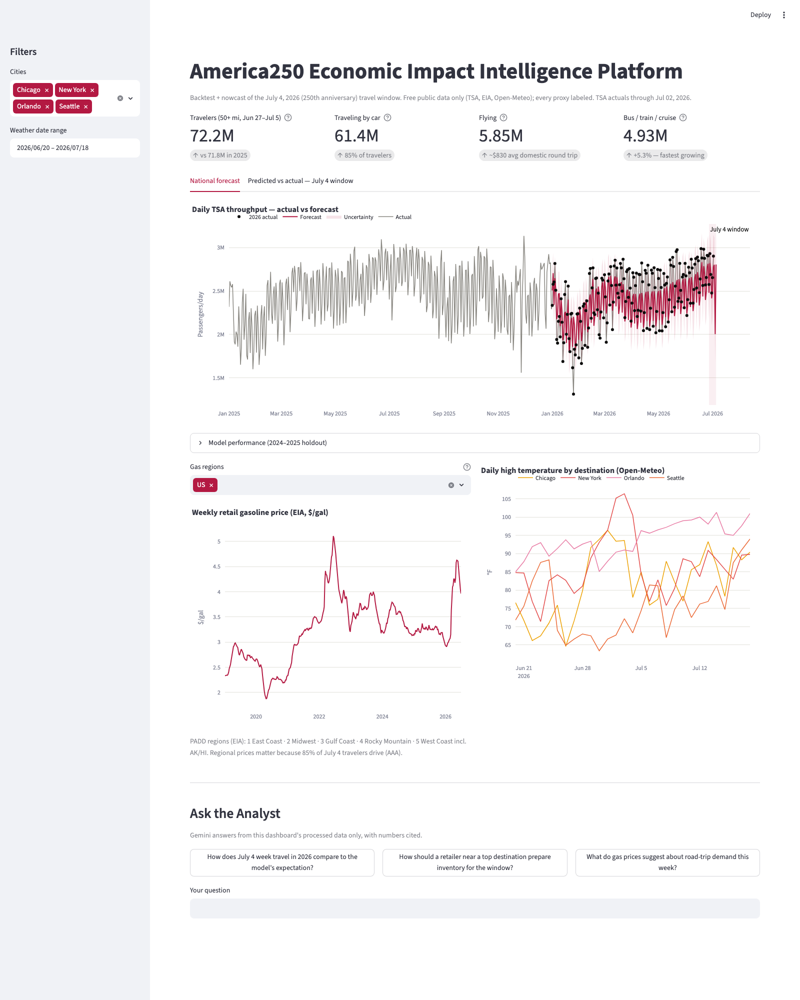

# America250 Economic Impact Intelligence Platform

**🔴 Live demo: [usa-250th.streamlit.app](https://usa-250th-wrdksypyzzwjjdcucxn9pe.streamlit.app/)**

A **backtest + nowcast + validation pipeline** for the economic impact of the
July 4, 2026 travel window — America's 250th anniversary. Models are trained on
historical holiday-travel patterns (2019–2025), project the June 27 – July 5,
2026 window, and are validated against actuals as TSA publishes them (~1-day
lag). Built entirely from **free, public, cited data** — every proxy and
interpolation is labeled.



## Headline result (as of July 3, 2026)

- Best model: **Prophet trained 2019–2023 with a COVID-period indicator** —
  **6.33% MAPE** on a full 2024–2025 holdout, beating a SARIMA baseline (9.22%)
  and a COVID-excluded Prophet variant (9.73%).
- **All six July-window actuals so far (Jun 27 – Jul 2) fall inside the
  forecast's uncertainty interval**, running ~2–6% above the point forecast —
  consistent with AAA's record 72.2M-traveler projection.

## Data sources & caveats

| Source | What | Grain | Caveats |
|---|---|---|---|
| [TSA passenger volumes](https://www.tsa.gov/travel/passenger-volumes) | Daily checkpoint throughput | National, daily | Public data starts **2019** (not earlier); site requires a browser User-Agent |
| [EIA gasoline prices](https://www.eia.gov/petroleum/gasdiesel/) | Weekly retail price, US + PADD 1–5 | Regional, weekly | **Proxy:** forward-filled weekly→daily for modeling; keyless XLS download |
| [Open-Meteo](https://open-meteo.com) | Daily weather, 8 focus cities | City, daily | Archive lags ~5 days; forecast API fills through the window |
| [Nager.Date](https://date.nager.at) | US public holidays | National | Nationwide holidays only |
| [BTS T-100 Segment (All Carriers)](https://www.transtats.bts.gov/DL_SelectFields.aspx?gnoyr_VQ=FMG&QO_fu146_anzr=Nv4+Pn44vr45) | Monthly departing passengers by airport (domestic + international, all carriers) | City (8 focus airports), monthly | **Manual browser download** — TranStats is script-hostile (PREZIP 404s, legacy POST 500s, bts.gov 403s non-browser clients; verified 2026-07-07). Publishes with a ~2–3 month lag (latest available: March 2026) |
| [Census ACS](https://www.census.gov/data/developer/data-sets/acs-1year.html) | Population + median household income, 8 focus cities | City, annual | Free API key required since ~2025 (`CENSUS_API_KEY` in `.env`, instant signup); ACS 1-year preferred, falls back to 5-year per place |
| [America250 events](data/reference/america250_events.csv) | Curated calendar of America250-branded events in the 8 focus cities | City, dated | No machine-readable source exists; hand-researched, every row cites a `source_url` |

Deliberately **excluded**: STR hotel occupancy and real-time card spending —
both are paid/proprietary. Census MRTS retail was also dropped from the city
layer for grain honesty (it's national-grain data; a city index shouldn't
borrow national numbers to look more complete than it is). Nothing here is
fabricated; where a free proxy stands in (gas ffill, future gas held at last
observed value), the dashboard and code say so explicitly.

## Methodology

Daily TSA throughput is forecast with Prophet (native US holiday effects;
extra regressors: national gas price and a 2020-03→2021-12 COVID indicator so
pandemic collapse/recovery doesn't contaminate seasonality). Two Prophet
variants (2019+ with the indicator vs 2022+ excluding COVID) and a SARIMA(1,1,1)
×(1,1,1,7) baseline are compared on a held-out 2024–2025 period (MAE/MAPE in
`data/processed/metrics.csv`); the winner is refit through 2025-12-31 and
projects Jan 1 – Jul 5, 2026, so 2026 actuals can be overlaid as they land.

## City Impact layer

The national forecast says how many people are traveling; the City Impact
layer asks *where America250 demand concentrates*. July 4, 2026 has already
passed and BTS T-100 (the only air-traffic source) publishes 2–3 months
behind, so the index is framed honestly as **exposure, not impact**:
structural capacity to capture anniversary demand, paired with an
**observed-lift readout** (YoY air-passenger momentum) where real data
already exists. When July 2026 T-100 publishes (~October 2026), the
momentum readout will show the actual anniversary-week lift for each city —
mirroring the national forecast-vs-actual story.

The composite score blends four components (0–100 each, min-max scaled
across the 8 focus cities) with default weights:

| Component | Weight | Source | Why this weight |
|---|---|---|---|
| Air capacity | 0.40 | BTS T-100, latest 12 months of departing passengers | Largest weight — the most direct, observed proxy for a city's travel-demand capacity |
| Events | 0.30 | America250 event calendar, summed scale tier (1=local, 2=regional, 3=national) | Anniversary-specific signal no other component carries — is this city hosting flagship programming? |
| Population | 0.20 | Census ACS total population | Demographic amplifier — larger cities have more latent capacity to absorb and generate spending |
| Income | 0.10 | Census ACS median household income | Smallest weight — correlates with discretionary travel spending but carries the weakest anniversary-specific signal |

Weights are configurable live in the dashboard (`Adjust index weights`
expander); the composite re-ranks instantly from the committed component
scores.

**Clustering caveat:** the dashboard also shows a KMeans (k=3) segmentation
of the 8 cities into "National anniversary magnets" / "Strong regional
draws" / "Focused local hosts". With only 8 observations this is an
**illustrative technique demo, not statistical inference** — the dashboard
caption says so explicitly.

**Refresh cadence:** T-100 publishes monthly with a ~2–3 month lag (latest
available as of this writing: March 2026). To refresh:

1. In a browser, go to [TranStats T-100 Segment (All Carriers)](https://www.transtats.bts.gov/DL_SelectFields.aspx?gnoyr_VQ=FMG&QO_fu146_anzr=Nv4+Pn44vr45).
2. Set "Filter Year" to the year you need, tick `YEAR`, `MONTH`, `ORIGIN`,
   `DEST`, `PASSENGERS`, click Download.
3. Save the zip(s) into `data/raw/`, keeping "T100" in the filename (one
   download per year if the form requires it).
4. Run `venv/bin/python run_pipeline.py` and push the updated
   `data/reference/t100_city_monthly.csv` and `data/processed/city_*.csv`.

TranStats has no script-friendly endpoint — pre-zipped files 404, the
legacy POST download 500s, and bts.gov 403s non-browser clients (verified
2026-07-07) — so this step stays manual by design.

## Architecture

Precompute-and-commit: ingestion and modeling run locally; the Streamlit app
reads only the committed `data/processed/` CSVs (fast cold start, no scraping
from cloud IPs, no training on the free tier).

```
run_pipeline.py          ingest -> build -> forecast -> city layer (local)
src/ingest/              tsa.py · eia_gas.py · weather.py · holidays.py · build_dataset.py
                         bts_t100.py · census_acs.py
src/model/forecast.py    Prophet variants + SARIMA baseline + metrics
src/model/               city_index.py (composite exposure index + momentum)
                         city_cluster.py (KMeans segmentation)
data/processed/          committed outputs — the app's only data source
data/reference/          committed T-100 city-month CSV + curated events CSV
app/                     Streamlit dashboard + Gemini "Ask the Analyst" panel
tests/                   pytest (parsing/transform contracts; no network)
```

## Run it

```bash
python3 -m venv venv && venv/bin/pip install -r requirements.txt
venv/bin/python run_pipeline.py        # refresh data + forecast (optional; outputs are committed)
venv/bin/streamlit run app/main.py
venv/bin/pytest                        # tests, no network needed
```

**Ask the Analyst** (optional): put a free Gemini key (aistudio.google.com — no
credit card) in `.env` as `GEMINI_API_KEY=...`. The panel answers questions
strictly from the processed data, citing the numbers it uses
(`gemini-2.5-flash`, falling back to `gemini-2.5-flash-lite` on rate limits).
Without a key the panel shows setup instructions and everything else works.

**City Impact layer** (optional): put a free Census key
(api.census.gov/data/key_signup.html — instant, no credit card) in `.env` as
`CENSUS_API_KEY=...`. Without it, `run_pipeline.py` skips the city layer
cleanly and the dashboard's City Impact tab shows setup instructions;
everything else works. A fresh T-100 download in `data/raw/` is optional
too — the pipeline reuses the committed `data/reference/t100_city_monthly.csv`
if none is present.

## Roadmap

IsolationForest anomaly flags on the national series → predicted-vs-actual
post-mortem tab, once enough of the July 2026 window has actuals to
post-mortem against.

---
Built by [Chandana Gowda](https://chandanasgowda.com) · July 2026
